# Projet d'évaluation : Cloud, Floci et Terraform

Ce projet déploie deux services Cloud avec **Terraform** sur un environnement Cloud
local fourni par **Floci**. Ce README est complété au fil des étapes et permet de
reproduire le projet.


## Sommaire

- [Provider choisi](#provider-choisi)
- [Prérequis](#prérequis)
- [Étape 1 : Installation et lancement de Floci](#étape-1--installation-et-lancement-de-floci)
- [Dépannage](#dépannage)
- [Notes](#notes)
- [Références](#références)


## Provider choisi

- **Provider : AWS**, émulé localement par Floci.
- **Service 1 : Amazon S3** (stockage d'objets), déployé avec le module `storage`.
- **Service 2 : Amazon DynamoDB** (base de données NoSQL clé-valeur), déployé avec le module `database`.

**Pourquoi ces deux services :**

- **Supportés par Floci** : l'API de santé (`/_floci/health`) indique `s3` et `dynamodb`
  en `running`.
- **Visibles dans Floci UI** : la console propose une page **Storage** (S3) et une page
  **DynamoDB**, ce qui permet de vérifier les ressources après `terraform apply` puis
  après `terraform destroy`, comme le demande le sujet.
- **Complémentaires** : deux modèles de données différents, des objets (fichiers) d'un
  côté, des enregistrements clé-valeur de l'autre.
- **Simples à décrire avec Terraform** : une ressource principale chacun
  (`aws_s3_bucket`, `aws_dynamodb_table`), ce qui permet de se concentrer sur
  l'organisation du projet (modules, variables, locals, outputs).


---

## Étape 1 : Installation et lancement de Floci

Floci se compose de deux éléments : le **CLI `floci`**, un outil en ligne de commande
qui pilote l'émulateur, et l'**émulateur** lui-même, qui tourne dans un conteneur Docker
(image `floci/floci`). On installe d'abord le CLI, puis on lui demande de démarrer
l'émulateur.

### 1. Installer le CLI Floci

```bash
curl -fsSL https://floci.io/install.sh | sh
```

Méthode officielle indiquée sur <https://floci.io/>. `curl` télécharge le script
d'installation (`-f` échoue en cas d'erreur HTTP, `-s` reste silencieux, `-S` affiche
tout de même les erreurs, `-L` suit les redirections) et `| sh` l'exécute directement.

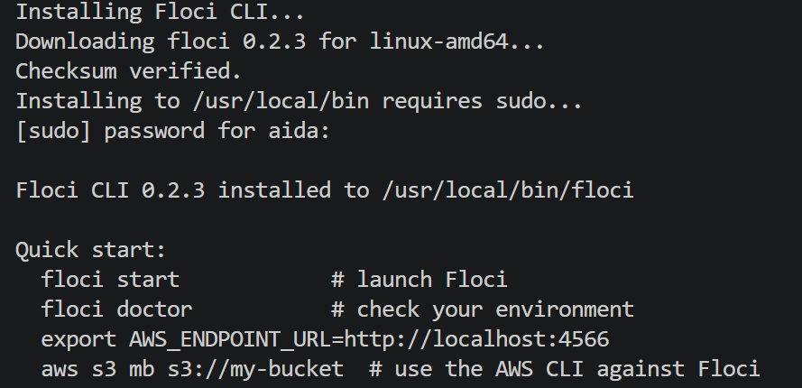

**Ce que montre la capture :**

- `Downloading floci 0.2.3 for linux-amd64` : le script a détecté mon système (Linux) et
  mon architecture (amd64), puis a choisi le binaire correspondant, en version **0.2.3**.
- `Checksum verified` : l'empreinte (checksum) du fichier téléchargé correspond à
  l'empreinte attendue ; le binaire n'est ni corrompu ni altéré.
- `Installing to /usr/local/bin requires sudo` : `/usr/local/bin` est un dossier système,
  réservé à l'administrateur, d'où la demande du mot de passe (`[sudo] password`). Le
  dossier fait partie du `PATH`, donc la commande `floci` est utilisable depuis
  n'importe quel répertoire.
- `Floci CLI 0.2.3 installed to /usr/local/bin/floci` : l'installation est terminée.

### 2. Démarrer Floci

```bash
floci start
```

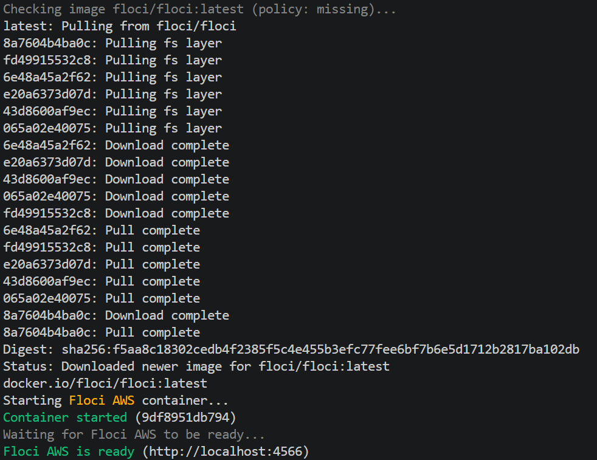

**Ce que montre la capture :**

- `Checking image floci/floci:latest (policy: missing)` : le CLI cherche l'image Docker
  de l'émulateur. La politique `missing` signifie qu'elle n'est téléchargée **que si
  elle est absente** de la machine.
- `Pulling from floci/floci` et les lignes `Pull complete` : une image Docker est
  composée de couches (*layers*) téléchargées séparément ; chaque `Pull complete`
  indique qu'une couche est prête.
- `Digest: sha256:f5aa8c18…` : empreinte unique de la version exacte de l'image
  téléchargée.
- `Status: Downloaded newer image for floci/floci:latest` : l'image a bien été
  téléchargée (c'est le premier lancement).
- `Starting Floci AWS container...` puis `Container started (9df8951db794)` : le
  conteneur est créé et démarré ; `9df8951db794` est son identifiant.
- `Floci AWS is ready (http://localhost:4566)` : le CLI a attendu que l'émulateur
  réponde et donne son adresse.

Le mot **AWS** dans ces messages confirme que c'est l'émulateur du provider choisi qui
a été lancé.

### 3. Identifier le port utilisé par le provider choisi

Le CLI Floci choisit le provider **par la commande de démarrage** :

| Provider | Commande de démarrage | Port |
|---|---|---|
| **AWS** (choisi) | `floci start` | **4566** |
| Azure | `floci az start` | 4577 |
| GCP | `floci gcp start` | 4588 |
| OCI | `floci oci start` | 4599 |

Chaque provider est un émulateur distinct, avec sa propre image et son propre port. En
lançant `floci start` sans sous-commande, j'ai démarré l'émulateur **AWS**, dont le
port est **4566**. Je le vérifie avec Docker :

```bash
docker port floci
```

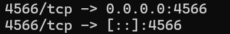

**Ce que montre la capture :** la commande affiche les ports que le conteneur `floci`
expose sur ma machine. La ligne `4566/tcp -> 0.0.0.0:4566` signifie que le port 4566
(TCP) du conteneur est accessible sur le port 4566 de ma machine, sur toutes les
interfaces IPv4 ; la ligne `[::]:4566` correspond à la même chose en IPv6. Le port de
l'émulateur AWS est donc bien **4566**.

### 4. Configurer le terminal

```bash
eval $(floci env)
env | grep -i aws | grep -viE 'key|secret|token'
```

`floci env` affiche des commandes `export` ; `eval` les exécute dans le terminal
courant, ce qui explique que la première commande n'affiche rien. La seconde vérifie le
résultat en deux filtres :

- `env` liste toutes les variables d'environnement, et `grep -i aws` ne garde que les
  lignes contenant « aws » (sans tenir compte de la casse) ;
- `grep -viE 'key|secret|token'` **exclut** ensuite toute ligne contenant « key »,
  « secret » ou « token », pour ne jamais afficher d'identifiants.

Ce second filtre est volontaire : par bonne pratique, aucun identifiant ne doit figurer
dans un README ou une capture d'écran. Ici les identifiants définis par Floci sont
factices, mais la même commande sans filtre afficherait de vraies clés AWS si j'en avais
configuré sur ma machine.

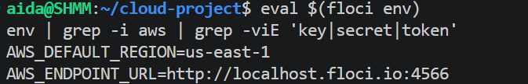

**Ce que montre la capture :** les variables non sensibles définies par `floci env`.
 On y retrouve :

- `AWS_ENDPOINT_URL=http://localhost:4566` : l'adresse à laquelle les outils AWS envoient
  leurs requêtes. C'est cette variable qui les redirige vers Floci au lieu du vrai AWS
  (notion d'**endpoint local**) ;
- la région par défaut (`us-east-1`).

`floci env` définit aussi un identifiant d'accès et une clé secrète, volontairement non
affichés. Selon la documentation de Floci, ce sont des valeurs **factices** : l'émulateur
accepte n'importe quelle valeur non vide, donc aucun vrai compte n'est utilisé. Avec le
vrai AWS, en revanche, ces clés sont de vrais secrets qu'il ne faut jamais commiter, ce
que le `.gitignore` du projet prévoit (`*.pem`, `*.key`, fichiers d'identifiants).

Ces variables sont perdues à la fermeture du terminal : il faut relancer
`eval $(floci env)` dans chaque nouveau terminal.

### 5. Vérifier que le service fonctionne

La vérification est faite à quatre niveaux, du plus technique au plus visuel.

#### a) Diagnostic du CLI

```bash
floci doctor
```

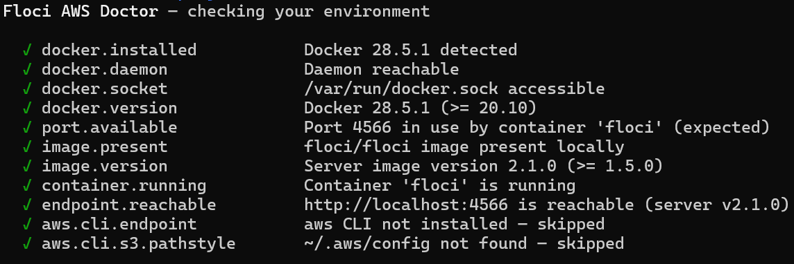

**Ce que montre la capture :** onze contrôles, tous marqués ✓, et le message
`All checks passed.` En détail :

- `docker.installed`, `docker.daemon`, `docker.version` : Docker 28.5.1 est installé, son
  service répond, et sa version est suffisante (≥ 20.10 requis).
- `docker.socket` : le socket `/var/run/docker.sock` est accessible. Floci en a besoin
  pour piloter Docker (il lance ses conteneurs et certains services).
- `port.available` : le port 4566 est déjà utilisé, mais par le conteneur `floci`
  lui-même, ce qui est le comportement attendu (`expected`).
- `image.present` et `image.version` : l'image `floci/floci` est présente localement et le
  serveur est en version **2.1.0** (≥ 1.5.0 requis).
- `container.running` : le conteneur `floci` tourne.
- `endpoint.reachable` : `http://localhost:4566` répond (serveur v2.1.0).
- `aws.cli.endpoint`, `aws.cli.s3.pathstyle` : ignorés (`skipped`) car le CLI AWS n'est
  pas installé ; cela n'empêche pas Floci de fonctionner.

#### b) État du conteneur Docker

```bash
docker ps
```

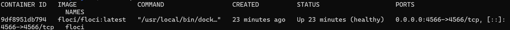

**Ce que montre la capture :** la liste des conteneurs en cours d'exécution, avec une
seule ligne, `floci` :

- `IMAGE floci/floci:latest` : l'image utilisée ;
- `STATUS Up … (healthy)` : le conteneur tourne et son contrôle de santé interne réussit ;
- `PORTS 0.0.0.0:4566->4566/tcp, [::]:4566->4566/tcp` : le port 4566 est publié (IPv4
  et IPv6), ce qui confirme la vérification de l'étape 3 ;
- `NAMES floci` : nom du conteneur.

#### c) Réponse de l'API de santé

```bash
curl http://localhost:4566/_floci/health
```

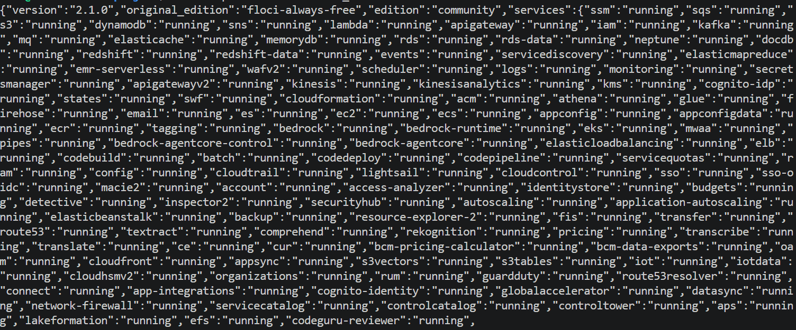

**Ce que montre la capture :** `curl` envoie une requête HTTP à l'émulateur, qui répond
en JSON :

- `"version":"2.1.0"` : version du serveur Floci ;
- `"edition":"community"` : édition gratuite ;
- `"services":{…}` : l'état de chaque service émulé. `"running"` signifie que le service
  est démarré et prêt. On y trouve notamment `s3`, `dynamodb` et `secretsmanager`, qui
  pourront servir au projet.

#### d) Page d'accueil dans le navigateur

Ouvrir <http://localhost:4566> dans le navigateur.

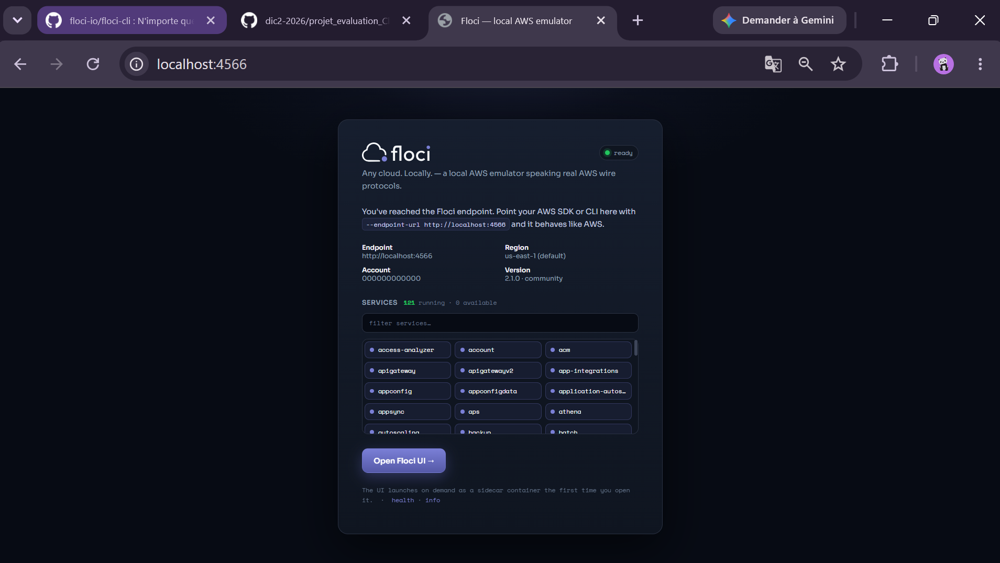

**Ce que montre la capture :**

- `ready` : l'émulateur est prêt ;
- `Endpoint http://localhost:4566` : l'adresse et le port de l'API ;
- `Region us-east-1 (default)` : région par défaut de l'émulateur ;
- `Account 000000000000` : identifiant de compte par défaut. Floci l'utilise lorsque la
  clé d'accès n'est pas un identifiant de 12 chiffres, ce qui est le cas de `test` ;
- `Version 2.1.0 · community` : version et édition du serveur ;
- `Services 121 running · 0 available` : 121 services émulés, tous démarrés.

Floci (AWS) est installé, démarré
dans le conteneur `floci`, joignable sur le port **4566**, et ses services sont
opérationnels.


---

## Étape 2 : Lancement de Floci UI

**Floci UI** est une console web, dans le style de la console AWS, qui permet
d'explorer les services de l'environnement local. Dans ce projet, elle sert à
**explorer et vérifier** les ressources : celles-ci seront créées avec Terraform, pas
depuis l'interface.

### 1. Lancer Floci UI

Aucune installation supplémentaire n'est nécessaire : Floci lance l'interface à la
demande. Depuis la page d'accueil de Floci (<http://localhost:4566>), cliquer sur le
bouton **Open Floci UI**.

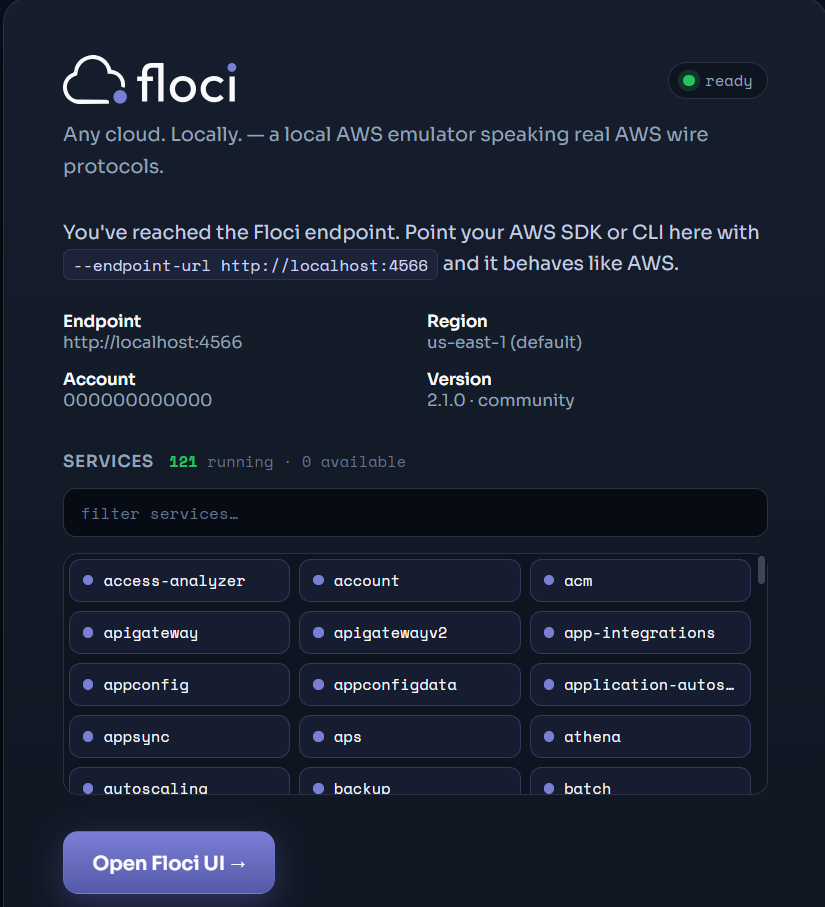

**Ce que montre la capture :** en bas de la page, une note indique que l'interface
utilisateur se lance à la demande, sous forme de **conteneur annexe (*sidecar*)**, lors
de la première ouverture. Floci démarre donc lui-même un second conteneur pour l'UI. Cela
est possible car Floci a accès au socket Docker de la machine (contrôle `docker.socket` de
`floci doctor` à l'étape 1).

Vérification :

```bash
docker ps
```

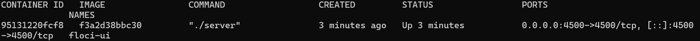

**Ce que montre la capture :** deux conteneurs actifs.

- `floci` (image `floci/floci:latest`) : l'émulateur AWS, port **4566**, actif depuis
  l'étape 1 et `healthy`.
- `floci-ui` : l'interface web, port **4500** (`0.0.0.0:4500->4500/tcp`), créé quelques
  minutes plus tôt, au moment du clic sur le bouton. Sa présence confirme le mécanisme
  de conteneur annexe.

### 2. Accéder à l'interface Web

Ouvrir <http://localhost:4500> : la console redirige vers
`http://localhost:4500/console/aws`.

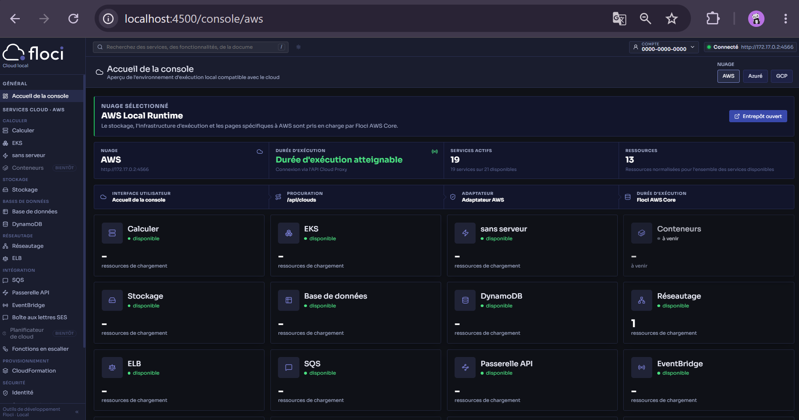

**Ce que montre la capture :** la page **Console Home**, accueil de la console.

- **Connexion** : l'indicateur vert *Connected* affiche `http://172.17.0.2:4566`. C'est
  l'adresse de l'émulateur telle que la voit le conteneur `floci-ui` : l'IP du conteneur
  `floci` sur le réseau interne de Docker. Depuis l'intérieur du conteneur de l'UI,
  `localhost` désignerait le conteneur de l'UI lui-même, d'où cette adresse.
- **Compte** : `0000-0000-0000`, identifiant de compte factice de l'émulateur (le même
  que `000000000000` sur la page d'accueil de Floci).
- **Chaîne de fonctionnement** : les quatre cartes sous le bandeau détaillent le trajet
  d'une requête : interface *Console Home* → proxy `/api/clouds` → adaptateur *AWS* →
  runtime *Floci AWS Core*.

### 3. Identifier le Cloud Provider choisi

Le provider choisi est **AWS** (voir la capture ci-dessus) :

- le sélecteur de cloud en haut à droite propose **AWS**, Azure et GCP ; **AWS** est
  sélectionné ;
- le bandeau indique **AWS Local Runtime**, et la carte *Cloud* affiche AWS avec l'endpoint
  `http://172.17.0.2:4566` ;
- la barre latérale liste les services du provider (section *Cloud Services · AWS*) ;
- l'URL contient le provider : `/console/aws`.

Azure et GCP sont proposés par l'interface mais dépendent d'émulateurs distincts
(`floci az`, `floci gcp`) qui ne sont pas lancés dans ce projet.

### 4. Explorer les services disponibles

La page d'accueil résume l'état du runtime : *Reachable runtime* (l'émulateur répond),
**19 services actifs sur 21 disponibles**, et **13 ressources** déjà présentes avant tout
déploiement. Elles ne viennent pas de mon projet : c'est l'état de référence de
l'environnement.

La barre latérale liste les services, regroupés par catégorie :

| Catégorie | Services affichés |
|---|---|
| Compute | Compute, EKS, Serverless, Containers *(bientôt disponible)* |
| Storage | **Storage** (S3) |
| Databases | Database, **DynamoDB** |
| Networking | Networking, ELB |
| Integration | SQS, API Gateway, EventBridge, Step Functions, Cloud Scheduler *(bientôt disponible)* |
| Provisioning | CloudFormation |

Chaque service disponible est aussi représenté par une carte sur la page d'accueil
(*available*). Deux entrées portent la mention *coming soon* : Containers et Cloud
Scheduler.

### 5. Identifier les deux services du projet Terraform

Les deux services retenus (voir [Provider choisi](#provider-choisi)) se retrouvent dans
la console :

| Service Terraform | Page de la console Floci UI |
|---|---|
| Amazon S3 | **Storage** |
| Amazon DynamoDB | **DynamoDB** |

> Remarque : le README du dépôt `floci-ui` indique que DynamoDB n'est pas encore intégré
> à la vue unifiée *Cloud Explorer*. Dans la version installée ici, DynamoDB dispose
> néanmoins d'une entrée dédiée dans la barre latérale, ce qui permet de l'utiliser pour
> la vérification.

---

## Notes

- Le fichier `.terraform.lock.hcl` est **versionné** (il n'est pas dans le `.gitignore`),
  conformément à la documentation Terraform : il garantit les mêmes versions de provider
  pour tous.

## Références

- Floci : <https://floci.io/> et <https://github.com/floci-io/floci>
- Floci CLI : <https://github.com/floci-io/floci-cli>
- Floci UI : <https://github.com/floci-io/floci-ui>
- Terraform : <https://developer.hashicorp.com/terraform/docs>
- Dependency Lock File : <https://developer.hashicorp.com/terraform/language/files/dependency-lock>
